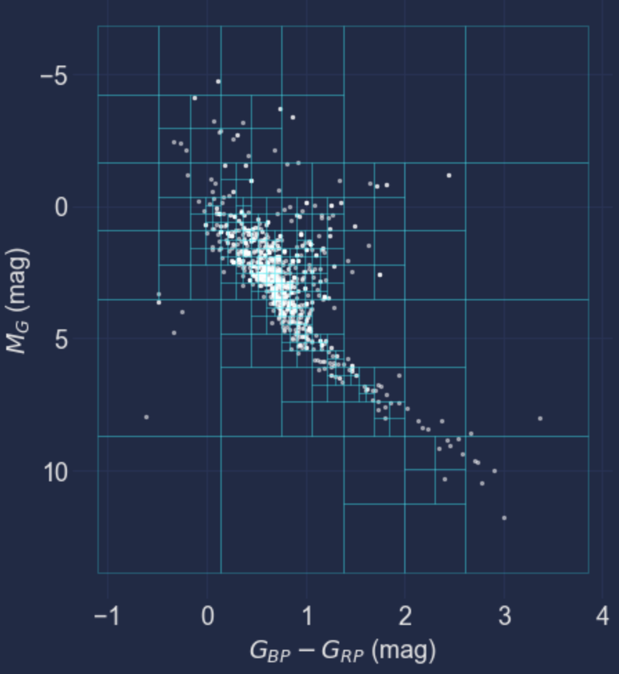

# Quad Tree Histogram 2D

Use a Quad Tree approach to create adaptive bin sizes and compute a histogram (counts or density) in 2 dimensions. Can specify limit on number of points per bin, and how many levels in the tree to go down. Uses `np.histogram2d` to lazily build each level of the tree, may be slow for very large number of points, or N levels.

Some simple experiments with using a triangular mesh included as well, but abandoned for now since KDTree & Ball Tree ideas already exist that are probably better suited for many other cases.

This project was developed in part at the [online.tess.science](https://online.tess.science) meeting, which took place globally in 2020 September.

Code originally developed for the [EBHRD project](https://github.com/jradavenport/EBHRD)
